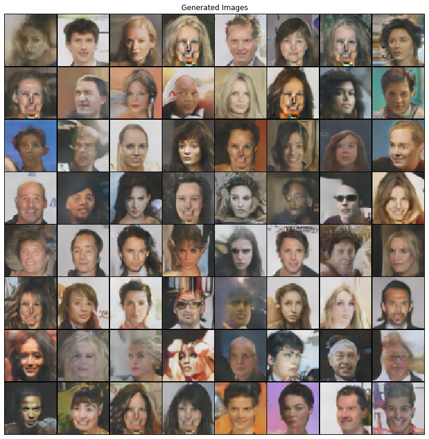

## [Unsupervised Representation Learning with Deep Convolutional Generative Adversarial Networks](https://arxiv.org/abs/1511.06434)

### Alec Radford, Luke Metz & Soumith Chintala

Saved weights can be found on my [gdrive](https://drive.google.com/drive/folders/1qSebyz5fwMFonhR8-fkDtup8-IwHsOa0?usp=sharing).

#### Result
