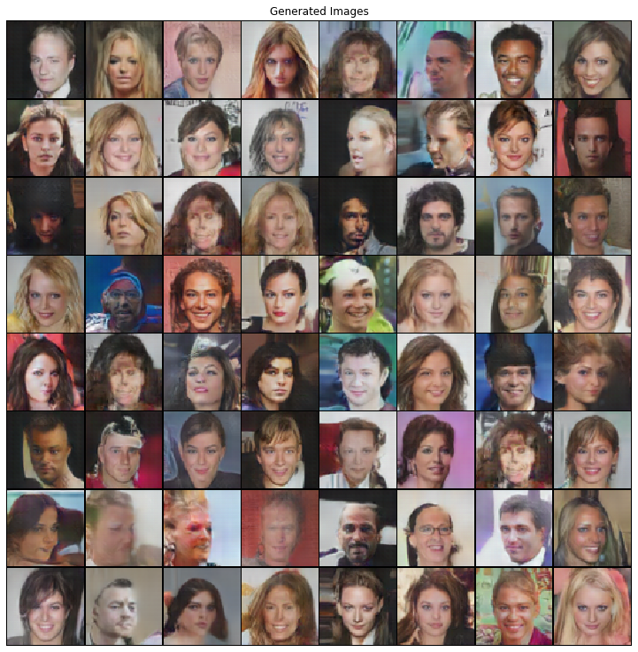

## [Unsupervised Representation Learning with Deep Convolutional Generative Adversarial Networks](https://arxiv.org/abs/1511.06434)

### Alec Radford, Luke Metz & Soumith Chintala

This is my [PyTorch](https://pytorch.org/) implementation of the DCGAN algorithm. It was my first *paper2pytorch* project and is heavly build on the official PyTorch [DCGAN Tutorial](https://pytorch.org/tutorials/beginner/dcgan_faces_tutorial.html).

Saved weights for the results below can be found on my [gdrive](https://drive.google.com/drive/folders/1qSebyz5fwMFonhR8-fkDtup8-IwHsOa0?usp=sharing).

#### Result
