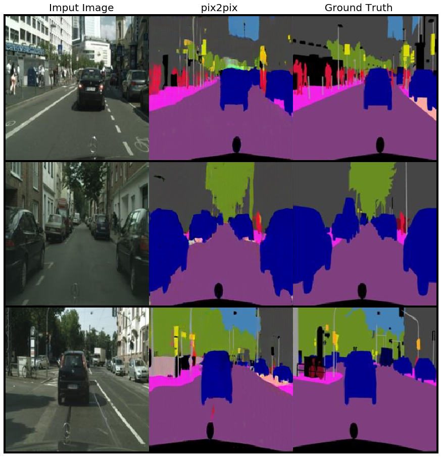
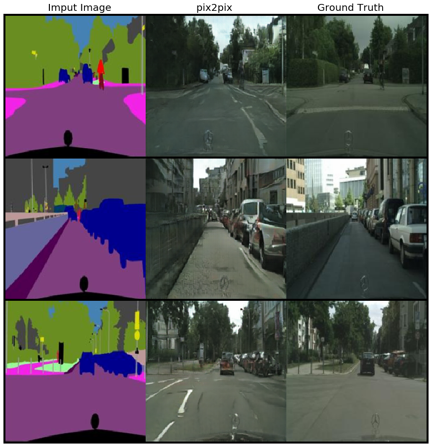
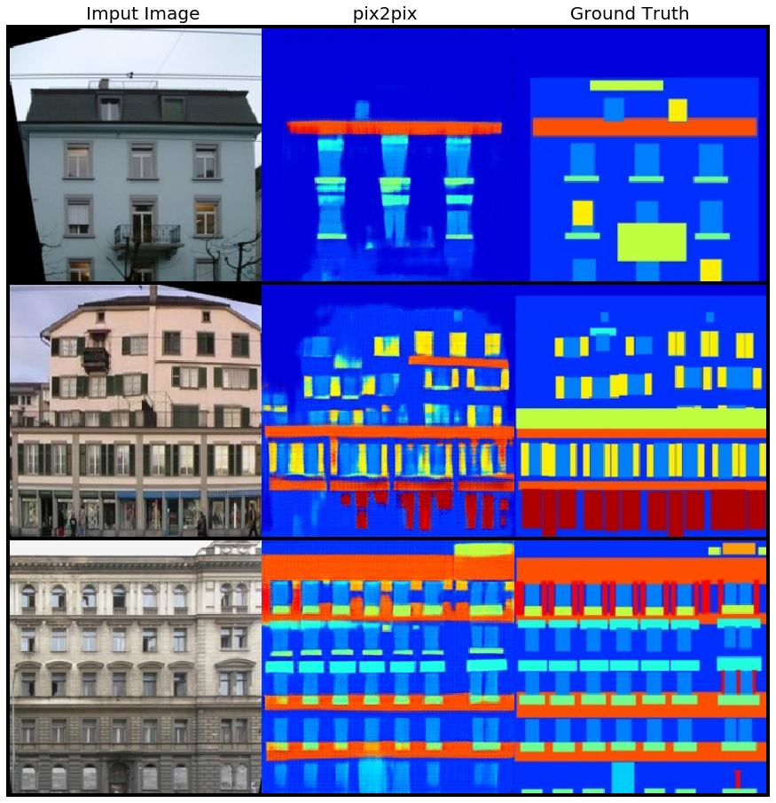
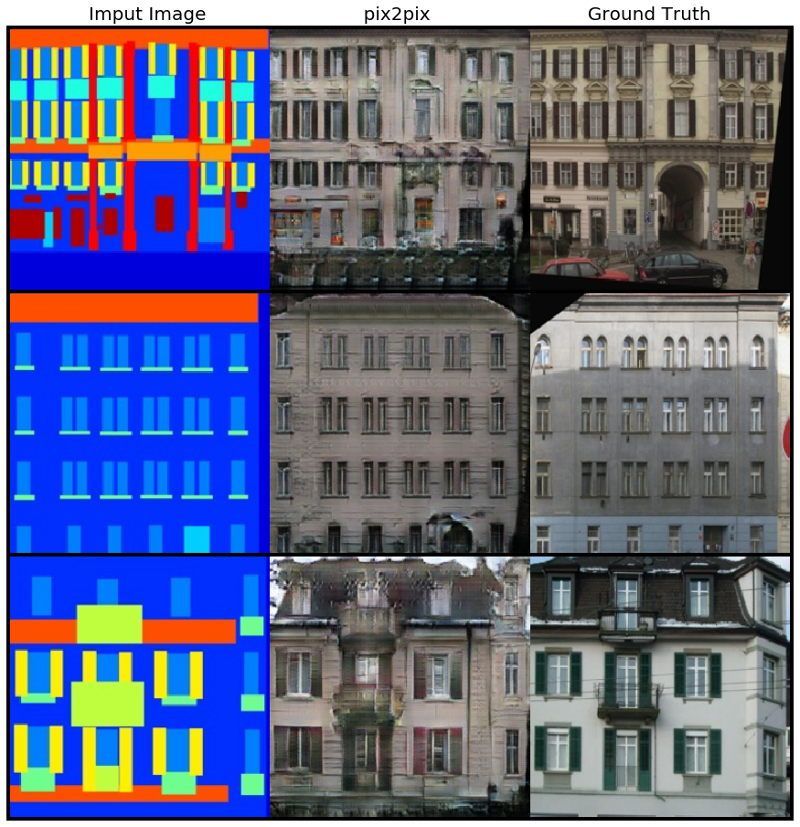
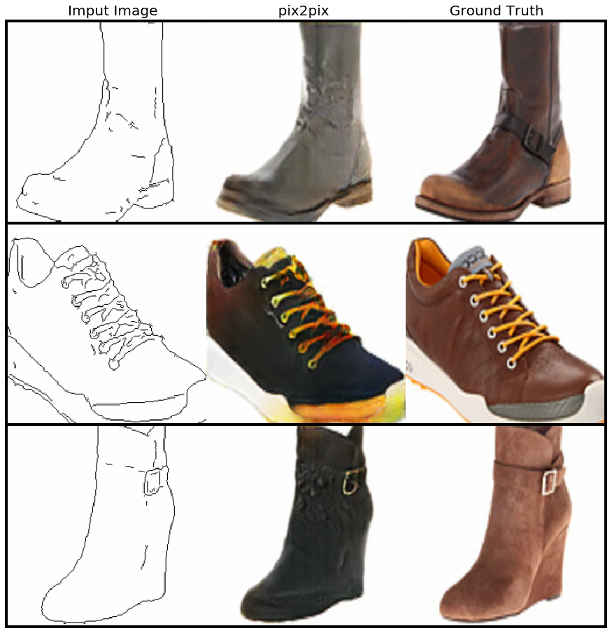
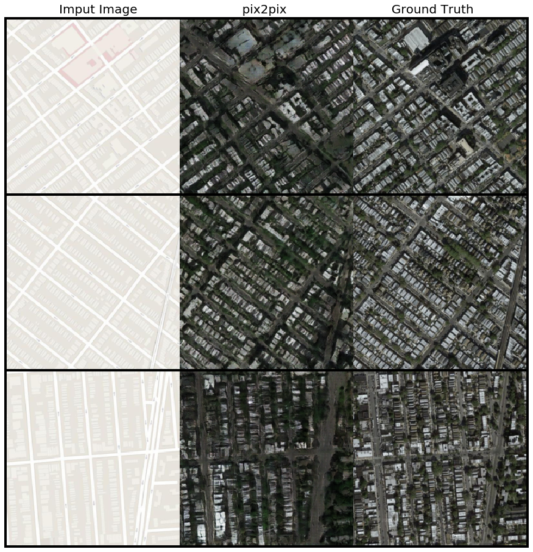

## [Image-to-Image Translation with Conditional Adversarial Networks](https://arxiv.org/abs/1611.07004)

### Phillip Isola, Jun-Yan Zhu, Tinghui Zhou & Alexei A. Efros

This is my [PyTorch](https://pytorch.org/) implementation of the pix2pix algorithm, which enables paired image-to-image translation. There is an official PyTorch implementation together with unpaired [CycleGAN](https://arxiv.org/abs/1703.10593) available on [this link](https://github.com/junyanz/pytorch-CycleGAN-and-pix2pix). This brilliant implementation was a constant source of inspiration for both this and my CycleGAN project.

Saved weights for the results below can be found on my [gdrive](https://drive.google.com/drive/folders/1qSebyz5fwMFonhR8-fkDtup8-IwHsOa0?usp=sharing).

#### Result
All results are trained from scratch with the presented code.

<table border="0">
 <tr>
    <td><b style="font-size:30px">A-to-B</b></td>
    <td><b style="font-size:30px">B-to-A</b></td>
 </tr>
 <tr>
    <td></td>
    <td></td>
 </tr>
  <tr>
    <td></td>
    <td></td>
 </tr>
  <tr>
    <td></td>
    <td>Not available yet...</td>
 </tr>
 <tr>
    <td>Not available yet...</td>
    <td></td>
 </tr>
</table>